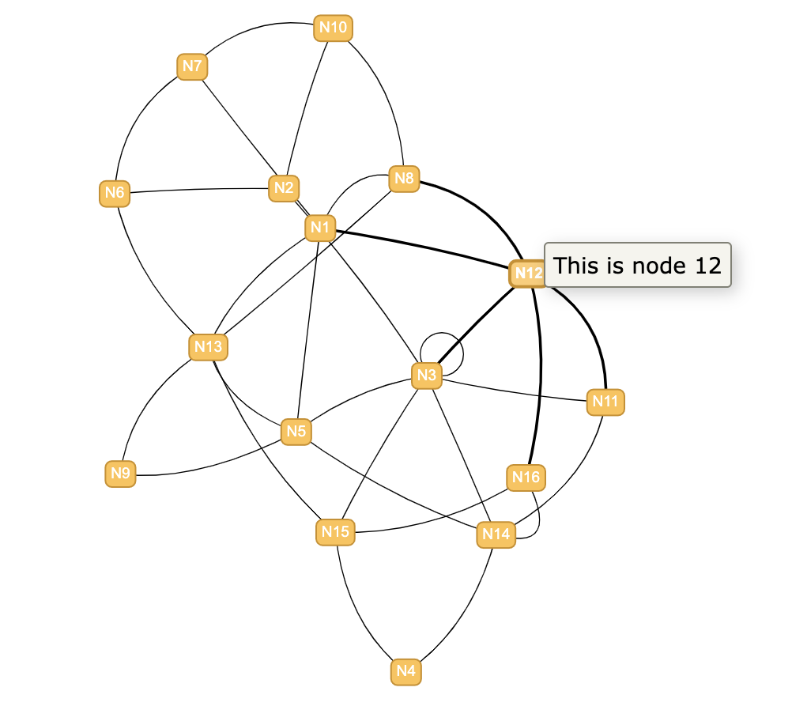

# visNetwork_tutorial
My exploration of the visNetwork library in R, using this tutorial: https://rpubs.com/a_pear_9/visNetwork

Download **network.html** and view in a browser to see the interactive visualisation produced by this code.

